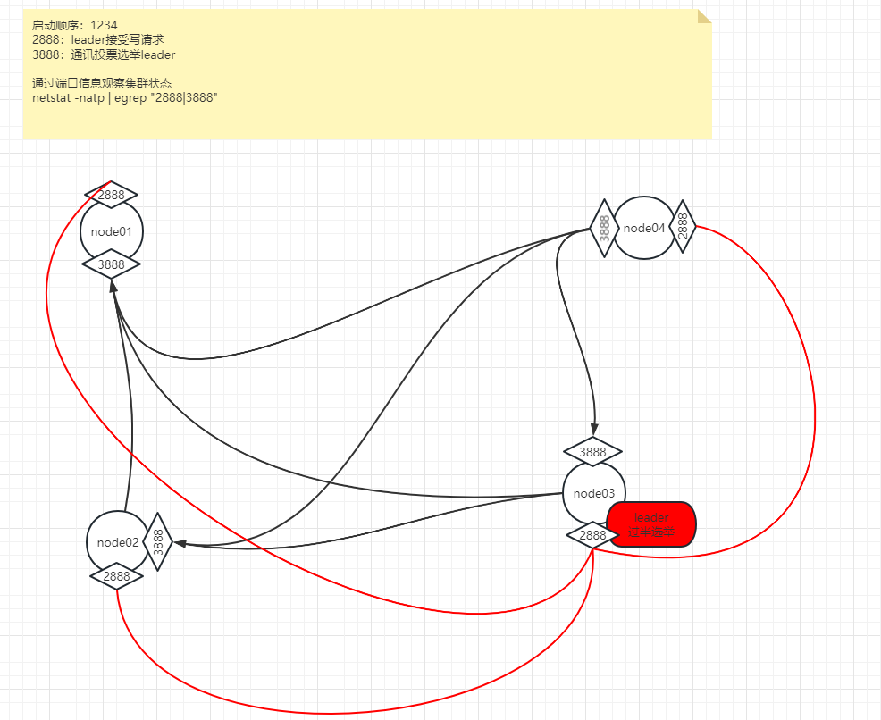

# [zookeeper](https://zookeeper.apache.org/doc/current/zookeeperOver.html) 
## 用途
```text
分布式协调服务
统一配置管理（1MB的数据）
分组管理（path结构[命名空间]）
统一命名（sequential）
同步（临时节点ephemeral）    


分布式锁
    锁依托一个父节点，且具备 -s 代表父节点下可以有多把锁，可以实现队列式事务的锁
    HA选主
       
zk是二进制安全的
zk的目的：
    减少网络带宽和数据时延

不要把zookeeper当做数据库使用
```

## 名称
- leader
- follow
- observer
- zNode
- ephemeral node


## 特点
- ZooKeeper 数据保存在内存中
  - 数据持久化问题
- ZooKeeper 允许被复制
  - 主从复制集群
    - leader 的单点问题 
      - leader快速修复
    - 数据一致性
  - 写操作只能发生在 leader 身上
  - 
- zookeeper很快：读写分离，读取比写入更常见的情况下表现最佳，比率约为 10:1。

## 数据模型和分层空间

zk 是一个目录树结构
node可以存储数据（官方推荐不要超过1MB）

 持久节点
 [临时节点](#短暂节点(ephemeral node))
 序列节点


### 短暂节点(ephemeral node)
client的session的支持

## 事件通知机制

## 条件更新和监视 Watch
3.6.0 中的新增功能：客户端还可以在 znode 上设置永久的递归监视，这些监视在触发时不会被删除，
并且会递归地触发已注册 znode 以及任何子 znode 上的更改。

```text
Watch 监控某一节点的状态，回调客户端注册的程序

当客户端之间存在关系，可以通过zk的session+enode产生的事件，由zk回调客户端注册的程序

```


## 保证
- 顺序一致性：客户端的更新将按照它们发送的顺序应用（为client及其其他follow服务）
- 原子性：最终一致性
- 单一系统映像：统一视图
- 可靠性：持久化
- 及时性：最终一致性（特定时间范围内是最新的）

## 简单的API
- create : creates a node at a location in the tree
- delete : deletes a node
- exists : tests if a node exists at a location
- get data : reads the data from a node
- set data : writes data to a node
- get children : retrieves a list of children of a node
- sync : waits for data to be propagated（向leader进行同步）

### 主从复制集群
> 只有Leader可写

zookeeper集群有两种运行状态：

    - 可用状态  

    - 不可用状态（无主模型：怎么让集群快速选出新的leader）

    

# 命令
```shell

# zkServer.sh [--config <conf-dir>] {start|start-foreground|stop|version|restart|status|print-cmd}
start（默认后台启动）
start-foreground （前台启动，输出日志到console）

# zkCli.sh
create [-s] [-e] [-c] [-t ttl] path [data] [acl]  # 创建节点
      -e  # 创建临时节点
      -s  # 创建序列节点 
get [-s] [-w] path # 获取节点数据
    cZxid = 0x200000002                     # 创建的事务id（前32位是leader的纪元，后32位是事务递增id）session的创建消失都会消耗事务id
    ctime = Fri Jun 05 13:57:06 PDT 2009    # 创建时间
    mZxid = 0x200000004                     # 修改事务id
    mtime = Fri Jun 05 13:57:06 PDT 2009    # 修改时间
    pZxid = 0x200000003                     # 当前节点下，创建的最后的节点的节点id号
    cversion = 0
    dataVersion = 0
    aclVersion = 0
    ephemeralOwner = 0x0                    # 临时所有者，默认创建的都是持久节点，当创建的是临时节点时，当前数值就是当前的session值，只要会话消失临时节点就会消失
    dataLength = 7
    numChildren = 0
set [-s] [-v version] path data # 设置检点数据
```

# zookeeper对自身定位

```text
扩展性
    角色：
        leader
        follower
        observer：observer的存在只是放大查询的能力
    读写分离（只有Follower才能选举）
可靠性
    攘外必先安内
    快速恢复leader
    对外提供服务
        一致性：最终一致性，
时序性
    只有leader可写
快速
```

# ZAB协议
通过 netstat -natp | egrep "2888|3888" 端口观察集群拓扑为


```text
zookeeper对paxos协议更简单的实现 ZAB协议（原子广播协议）
ZAB协议作用在可用状态（有Leader存在时）
ZAB原子广播协议
    原子：成功、失败，没有中间状态（基于队列+2阶段提交）
    广播：分布式多节点的，广播并不代表全部都能听到（过半）
    
    队列：先进先出、顺序性，leader为每个follower维护了一个队列
    

zookeeper的数据状态在内存，用磁盘保存日志


```


## Paxos 协议
[Zookeeper全解析——Paxos作为灵魂](https://www.douban.com/note/208430424/?_i=5178566kOI2XXk)

```text
Paxos被认为是到目前为止唯一的分布式一致性算法，其它的算法都是Paxos的改进或简化。
    Paxos(前提没有拜占庭将军问题)：只有在可信的计算环境中才能成立
        拜占庭将军问题：在存在消息丢失的不可靠信道上试图通过消息传递的方式达到一致性是不可能的
        
当所有节点全部平等存在的话，可能会出现一种现象“活锁”
    所谓活锁就是大家都没死，但是一直解决不了冲突，导致某一节点的问题一直会被推延
    
zk中是怎么选举leader的？
    每个节点会有自己的数据：
        myid    集群id
        Zxid    事务id
    新的leader需要具备的：
        1、Zxid最高的
        2、myid最大的
        * 前置：所有的数据全部来自于过半通过，过半通过的数据才是真数据
    1、第一次启动集群
        只有在启动三台之后，才会选出leader，节点比较myid，myid最大的作为leader
        
    2、重启集群，leader挂了之后
        3888造成两两通信连接
        只要任何人投票，都会触发那个准leader发起自己的投票
        推选制：先比较Zxid,如果Zxid相同，比较myid
    
```

# API

    callback -> reactive 响应式编程：可以更充分的压榨OS，HW资源、性能


## 分布式锁实现